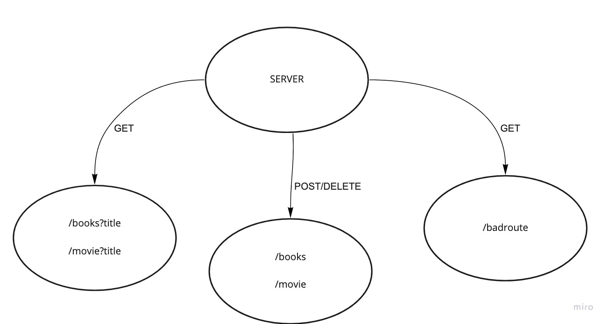

# Basic API Server

***

## Created by Cameron Walden

***

## Problem Domain 

Build a REST API using Express, by creating a proper series of endpoints that perform CRUD operations on a database, using the REST standard

***

## Routes

- **/book**

- **/movie**

***

## UML

